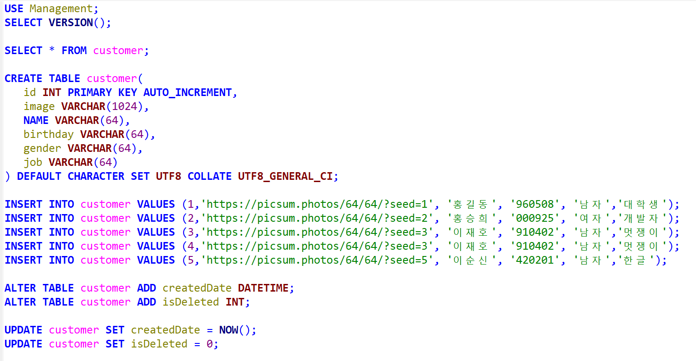
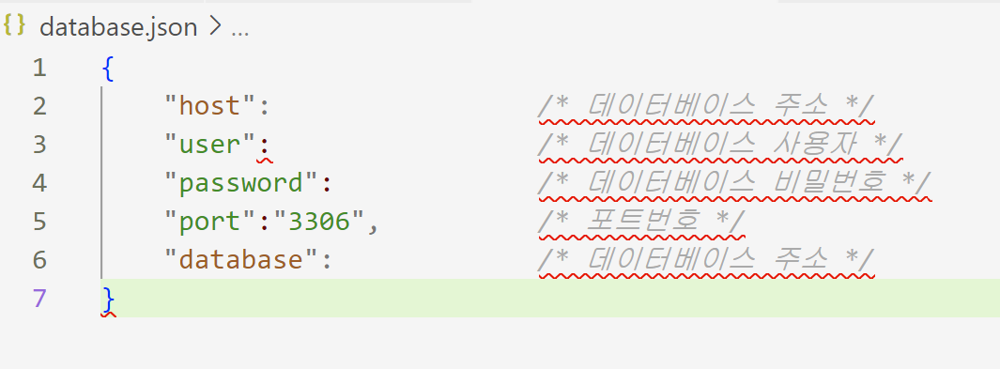

# React-Management
React와 Node.js 를 활용한 고객 관리 시스템

### AWS RDS 서비스를 이용하여 MySQL DB 구축
참고 자료 : https://data-make.tistory.com/771
참고 영상 : https://youtu.be/_yEH9mczm3g?feature=shared

#### AWS RDS로 MySQL DB 생성

HeidiSQL에서 위 사진과 같이 테이블 생성 후 테스트 insert 코드 생성

#### MySQL DB Express와 연동

database.json 파일을 생성하여 해당 주석과 같이 DB 정보 입력

#### React에서 사용하는 디자인 프레임워크 Material UI 개발 환경 구축 및 사용
* 터미널에서 `npm install @material-ui/core` 이렇게 입력하면 버전때문에 오류남. 
* 해결 방법 : `npm install @material-ui/core --legacy-peer-deps`, `npm install @mui/icons-material --legacy-peer-deps` 이렇게 하면 해결됨.
* 참고 자료 : https://mui.com/material-ui/react-app-bar/ 해당 링크에서 디자인 참고하여 App-bar 구현

